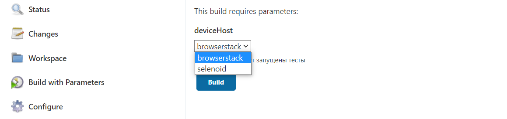
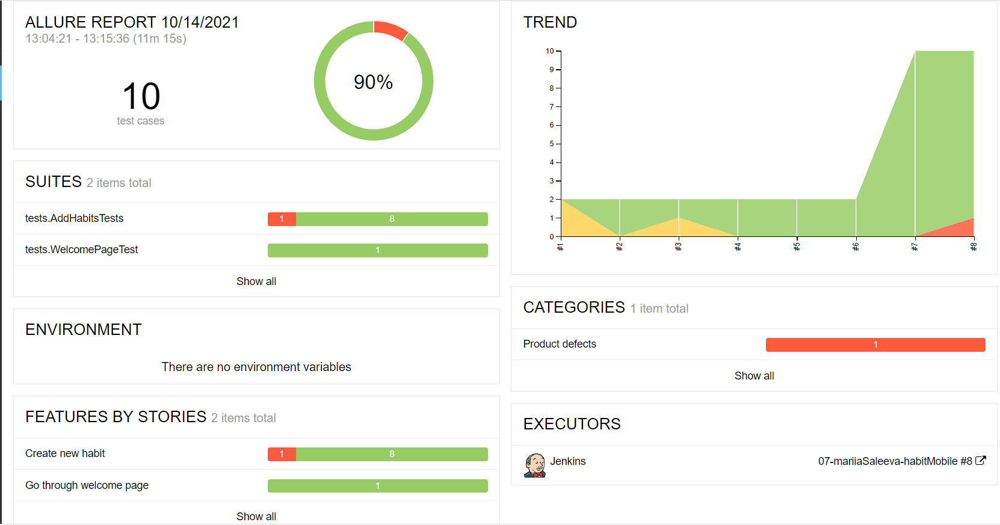
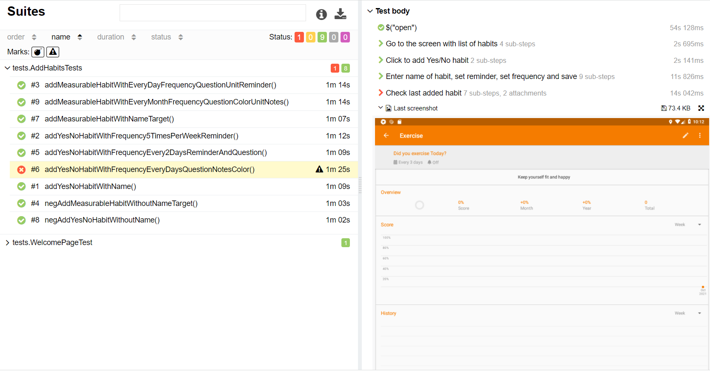

# Autotests for mobile application https://github.com/iSoron/uhabits

## Covered features:

- [x] going through welcome page
- [x] adding new Yes/No habit (positive and negative tests)
- [x] adding new measurable habit (positive and negative tests)

## Technology Stack:


Java, Gradle, JUnit5, Selenide, Appium, Jenkins, Selenoid, Browserstack, Allure Reports, Telegram (уведомления)

## Description

You can run tests by configuring the following parameters:

- deviceHost
  

### To run tests locally with files emulator.properties or realDevice.properties:

```
gradle clean test -DdeviceHost=emulator or -DdeviceHost=realDevice
```

### To run tests locally without files emulator.properties and realDevice.properties:

```
gradle clean test -DdeviceHost=emulator or -DdeviceHost=realDevice
 -DplatformName=Android
 -DdeviceName=Pixel_4_API_30
 -Dversion = 11.0
 -DappPackage=org.isoron.uhabits
 -DappActivity=org.isoron.uhabits.MainActivity
 -Dapp=src/test/resources/loop-2.0.3-release.apk
``` 

### To run tests on Selenoid without file selenoid.properties

```
gradle clean test -DdeviceHost=selenoid
 -DplatformName=Android
 -DdeviceName=android 
 -Dversion=8.1
 -DappPackage=org.isoron.uhabits
 -DappActivity=org.isoron.uhabits.MainActivity
 -Dapp=src/test/resources/loop-2.0.3-release.apk
```

### To run tests on BrowserStack without file browserstack.properties

```
gradle clean test -DdeviceHost=browserstack
   -Duser=
   -Dpassword=
   -Dapp=
   -Ddevice=Google Pixel 3
   -Dos_version=9.0
   -Dproject=habits
   -Dbuild=Java Android
   -Dname=add habits
```

## Allure reports

### Overview



### Test with steps, attached image, console logs



### Video


